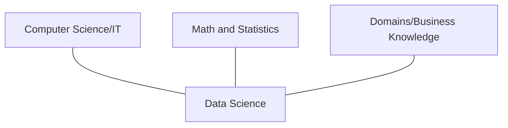

# Projet de Data Science : Pythoner les données

## 1. Introduction au projet
Dans le cadre de ce projet, nous disposons du dataset de la compétition Kaggle **« House Prices – Advanced Regression Techniques »**.

Ce dataset se base sur les ventes de biens immobiliers à Ames, Iowa, et comprend 79 colonnes (critères) qui permettent d’estimer le prix de vente.

Afin d’implémenter un modèle performant pour la banque **« Ames Banking Group »**, nous avons suivi les règles du **CRISP-ML**, de la phase d’idéation au déploiement théorique de cette solution.

---

## 2. Contexte bancaire
En tant que développeur au sein de l’institution bancaire **« Ames Banking Group »**, nous devons implémenter un modèle permettant aux conseillers clients d’estimer le montant maximum accordé pour le prêt hypothécaire lié à l’achat d’un bien immobilier.

Actuellement, l’évaluation des biens repose sur un traitement manuel effectué par les conseillers. Celui-ci est chronophage et peut s’avérer laborieux.

La banque dispose d’un entrepôt de données alimenté par l’historique des transactions ainsi que chaque nouvelle vente effectuée auprès du cadastre de la ville d’Ames.

Cette grande source de données permet d’alimenter et d’entraîner un modèle, permettant aux conseillers un gain de temps considérable, tout en limitant les biais humains.

---

## 3. En quoi notre projet respecte la Data Science : Trois piliers
Pour qu’un bon modèle respecte ces trois piliers, un certain nombre d’éléments doivent être pris en considération.



### Business :
* **Besoins métiers** : Le besoin métier consiste à estimer, de manière précise, le prix de vente d'une maison. Ceci afin d’orienter les conseillers lors des négociations liées au montant du prêt hypothécaire. Ces besoins se traduisent par des critères métiers définis dans le cadre bancaire (domaine pas forcément familier).
* **Gestion du risque** : Une marge d’erreur de 5% est intégrée. Ceci afin de limiter les risques, pour la banque, de prêter de l’argent et de ne pas pouvoir récupérer l’ensemble de ce montant en cas de défaut de paiement. *Point d’attention : éviter une marge d’erreur trop importante, sous peine de voir les clients se tourner vers la concurrence.*
* **Data** : Le jeu de données fourni contient énormément d’informations. Cependant, certaines d’entre elles ne sont pas ou peu pertinentes. De plus, certaines valeurs sont vides. Pour cette raison, il faut analyser le jeu de données (comme des économistes, ou alors comme de vrais pros) afin de faire ressortir des informations pertinentes de ces valeurs vides.

### Math & Stats :
* **Traitement des distributions** : L’analyse de la variable cible (`SalePrice`) révèle une distribution asymétrique. Une transformation mathématique (logarithmique) permet de normaliser les données et de stabiliser l’apprentissage des modèles.
* **Multicolinéarité** : Les variables ayant une forte corrélation sont retirées de l’entraînement. Après intégration de colonnes de « Feature engineering », qui permettent de regrouper certaines données (taille globale du bien, l’âge du bien lors de la vente ainsi que la durée depuis les précédentes rénovations), les données utilisées pour ces colonnes sont retirées afin de ne pas fausser le poids des statistiques linéaires.
* **Évaluation et optimisation** : Afin de comparer les modèles et leurs différentes versions, des métriques adaptées sont utilisées (RMSE, hyperparamètres).

### IT :
* **Ingénierie logicielle** : Implémentation de pipelines via la librairie standard et éprouvée de « scikit-learn ». Celle-ci permet de nettoyer les données et d’assurer que la solution est maintenable en production.
* **Prévention du data leakage** : L’architecture du modèle vise à éviter la fuite de données entre les datasets d’entraînement et de test.
* **Utilisation d’algorithmes avancés** : Utilisation d’un modèle XGBoost, connu pour son efficacité et ses performances, ainsi que sa capacité à se corriger à chaque étape et son meilleur contrôle du surapprentissage (*overfitting*).

---

## 4. Besoins et enjeux du projet
Le besoin principal est de fournir un outil d’aide à la décision, en temps réel, pour les employés de la banque. Lorsqu’une demande de prêt est effectuée par un client, le conseiller saisit les caractéristiques du bien immobilier et le système prédit le prix réel de celui-ci selon le marché, avant d’accepter ou de refuser.

Pour l’enjeu, il ne s’agit pas de fournir un modèle précis à 100%, mais d’optimiser les risques de pertes financières. À ce titre, le modèle doit garantir que le montant prêté n’est jamais supérieur au prix du marché, selon les informations à disposition. En cas d’insolvabilité du client, la banque doit pouvoir saisir et revendre le bien, sans générer de perte.

Dès lors, une surestimation serait problématique, alors qu’une sous-estimation serait acceptable (attention cependant à ne pas perdre des parts de marché à cause d’estimations trop basses).

---

## 5. Analyse exploratoire

### Distribution des prix
L’analyse de la variable cible « SalePrice » révèle une distribution asymétrique étalée vers la droite (*right-skewed*). La grande majorité des transactions se retrouvent entre 100 000 $ et 250 000 $, puis la courbe s’étire vers des biens plus « luxueux » et des prix plus conséquents.

*(Voir les graphiques originaux dans le PDF pour la comparaison entre la "Distribution de SalePrice" et la "Distribution de log1p(SalePrice)")*

En entraînant notre modèle sur ces valeurs brutes, l’algorithme serait biaisé par les quelques biens ayant une valeur plus conséquente, et risquerait de surestimer la valeur réelle, ce qui est l’inverse du but recherché par la banque.

En appliquant une transformation logarithmique « np.log1p », les valeurs extrêmes sont « écrasées » et on obtient une distribution « normale », ce qui permet de traiter les écarts de prix de manière proportionnelle.

### Les « Top Features » choisies
Dans notre étape d’analyse des données (`Data_Analysis.ipynb`), suite aux diverses discussions avec Lev ainsi que notre compréhension du métier et les indications trouvées sur Kaggle, nous avons retenu un total de 10 variables. Il s’agit des suivantes :
* **TotalBsmtSF** : Superficie du sous-sol
* **GrLivArea** : Surface habitable hors-sol
* **AgeAtSale** : Âge de la maison lors de la vente, variable créée en soustrayant « YearBuilt » à « YearSold »
* **OverallQual** : Condition générale de la maison
* **Neighborhood** : Quartier dans lequel se trouve le bien immobilier
* **GarageCars** : Taille du garage (en nombre de voitures)
* **LotArea** : Superficie du terrain
* **1stFlrSF** : Dimension du 1er étage
* **YearRemodAdd** : Année de rénovation (si différente de la construction)
* **KitchenQual** : Qualité de la cuisine

Pour chacune de ces variables, une analyse a été réalisée. Pour les variables numériques, la corrélation de Pearson et de Spearman, ainsi qu’une vérification des données manquantes, ont été réalisées afin de déterminer l’impact de chacune sur le prix de vente.

*(Voir le graphique dans le PDF : "Signal des variables numériques vs LogSalePrice")*

En ce qui concerne les variables catégoriques, la médiane des prix de vente a été analysée.

*(Voir les boxplots dans le PDF : "Distribution SalePrice par Neighborhood" et "Distribution SalePrice par KitchenQual")*

### Pourquoi l’algorithme permet de répondre au besoin
Suite à nos itérations (incluant les modèles Lasso, Random Forest, ElasticNet et XGBoost), nous avons opté pour le modèle XGBoost comme solution.

Cet algorithme permet de :
* Identifier les relations non linéaires complexes (exemple : un quartier qui prendrait de la valeur car une maison a été rénovée dernièrement).
* Obtenir de bonnes performances prédictives et minimiser l’erreur globale (RMSE).
* Permettre aux personnes du métier d’expliquer les raisons concernant les décisions liées au montant du crédit.

---

## 6. Modifications apportées au dataset
Afin de garantir la cohérence des données pour l’entraînement du modèle, un certain nombre de traitements ont dû être réalisés. Il s’agit des suivants :

* **Feature Engineering** : Afin de pallier le problème lié aux dates dans le dataset, nous avons calculé des durées relatives, qui sont bien mieux interprétées par les modèles. Pour les surfaces, celles-ci ont été ramenées à une variable unique afin que les maisons disposant d’un seul étage soient jugées équitablement par rapport à celles disposant de plusieurs.
  * **AgeAtSale** : `YrSold – YearBuilt`, permet d’obtenir l’âge de la maison lors de la vente.
  * **AgeRemodAdd** : `YrSold – YearRemodAdd`, permet d’obtenir l’année de rénovation (si différente de la construction).
  * **AgeGarage** : `YrSold – GarageYrBlt`, permet d’avoir l’âge du garage.
  * **TotalSF** : `TotalBsmtSF + 1stFlrSF + 2ndFlrSF`, pour la surface totale habitable.
  * **TotalBath** : `FullBath + 0.5 * HalfBath + BsmtFullBath + 0.5 * BsmtHalfBath`, pour obtenir l’indication du nombre de salles de bain disponibles dans la maison.
  * **IsRemodeled** : Valeur binaire permettant d’indiquer si la maison a été rénovée, en comparant l’année de construction à l’année de rénovation.

* **Suppression des outliers** : Selon les informations du document de recherche de Dean DeCock (https://jse.amstat.org/v19n3/decock.pdf) fourni par Kaggle, il est conseillé de retirer les maisons ayant plus de 4 000 « square feet » de surface habitable.

* **Traitement des valeurs nulles** : Dans certains cas, l’absence de valeur signifie que cette variable n’est pas présente dans la maison. Ces absences de valeurs ont été analysées et traitées en fonction de la situation de chacune :
  * *Remplacement par « None »* : Si « NaN » signifie l'absence justifiée de la variable catégorielle.
  * *Remplacement par le mode* : Si « NaN » signifie qu’il s’agit d’une variable catégorielle pour laquelle il y a une vraie donnée manquante.
  * *Remplacement par les valeurs les plus proches avec KNNImputer* : Si « NaN » signifie qu’une variable numérique est absente.

* **Encodage** : Certaines variables ordinales, liées à la qualité ou aux conditions, disposent d’un ordre logique. Afin de définir et respecter cet ordre, un mappage a été réalisé de la manière suivante :
  * **5** : Ex – Excellent
  * **4** : Gd – Good
  * **3** : TA – Typical / Average
  * **2** : Fa – Fair
  * **1** : Po – Poor
  * **0** : None – Valeur définie suite aux transformations
  * **0** : Vide – Absence de valeur

* **Suppression** : Les variables redondantes ou celles qui ont été transformées (exemple : les dates) ont été retirées afin de stabiliser le modèle et ainsi réduire le « bruit » qu’elles engendrent entre elles.

---

## 7. Modèle retenu
Différents modèles ont été testés afin de comparer les performances :
* Régression Lasso
* ElasticNet
* Random Forest
* XGBoost

Le modèle retenu est le **XGBoost**.

Couplé à **Optuna**, qui itère afin d’obtenir les meilleurs paramètres, ce modèle obtient les meilleurs résultats et est donc le plus performant pour nos besoins, dans un temps acceptable (entre 5 et 10 minutes pour 80 essais).

Les résultats des autres modèles restent valables et acceptables. Cependant, la recherche d’une estimation cohérente et permettant de valider le prix au plus juste nous pousse vers ce modèle.

L’utilisation de `TargetEncoder` (de la librairie `category_encoders`) permet de traiter efficacement la variable `Neighborhood` en remplaçant la catégorie par la moyenne cible et ainsi obtenir une valeur plus précise. Chaque quartier est analysé séparément (exemple : *Northwest Ames*) et obtient un `SalePrice` moyen selon les prix de vente de celui-ci, qui remplace le nom du quartier.

> [!NOTE]
> *(@Nilo : C’est bien ça dont on avait discuté avec Lev quand tout le monde était parti ? Dans l’idée de reprendre la moyenne par quartier plutôt que la moyenne générale de tous les quartiers)*

### MLFlow
Le suivi des expérimentations a été réalisé via MLFlow. Ceci permet de tracer les métriques (RMSE), les hyperparamètres d’Optuna et de visualiser les performances via un tableau de bord.

> [!IMPORTANT]
> **AJOUTER LE MLFLOW AU MODELE FINAL (POUR AVOIR UN KIKOO AFFICHAGE)**
> *Et détailler ce qu’on a quand c’est fait :D*

---

## 8. Évaluation métier de l’erreur de prédiction
Bien que notre modèle soit évalué mathématiquement par la **RMSE** (*Root Mean Squared Error*) en validation croisée, cette métrique pénalise autant les surestinations que les sous-estimations.

Dès lors, pour répondre à notre contrainte métier liée à la banque, nous analysons le biais moyen. Sachant qu'aucune IA n'est parfaite à 100%, nous avons instauré une règle métier : **l'application d'une marge de sécurité de 5% sur la prédiction de l'algorithme**.

Cette décote garantit que même si le modèle surévalue légèrement un bien, l'offre de financement finale restera sous le prix réel du marché de la liquidation.

---

## 9. Simulation de l’outil d’aide à la décision
Lorsqu’un client demande un prêt à la banque, un certain nombre d’informations doivent être renseignées pour que le modèle fonctionne. Celles-ci se retrouvent dans le cadastre de la ville d’Ames. Il suffit d’importer les données liées au bien immobilier ainsi que la valeur du prêt hypothécaire demandé par le client pour définir si l’estimation de la maison permet de rembourser le montant du prêt.

### Code de simulation

```python
def decision_pret_bancaire(prix_demande, prediction_modele, marge_securite_pct=0.05):
    """
    Simule la décision de la banque basée sur la prédiction du modèle.
    """
    valeur_garantie = prediction_modele * (1 - marge_securite_pct)
    
    print("--- DOSSIER DE PRÊT IMMOBILIER ---")
    print(f"Montant demandé par le client : {prix_demande:,.0f} $")
    print(f"Estimation de l'IA (XGBoost)   : {prediction_modele:,.0f} $")
    print(f"Valeur retenue (Garantie -5%) : {valeur_garantie:,.0f} $")
    print("-" * 34)
    
    if prix_demande <= valeur_garantie:
        print("APPROUVÉ : La valeur du bien couvre le risque")
    else:
        ecart = prix_demande - valeur_garantie
        print(f"REFUSÉ : La valeur du bien ne couvre pas le risque. Écart à combler : {ecart:,.0f} $")

# Exemple d'exécution lors d'un rendez-vous client
decision_pret_bancaire(prix_demande=250000, prediction_modele=258000)
```

**Sortie de la simulation :**
```text
--- DOSSIER DE PRÊT IMMOBILIER ---
Montant demandé par le client : 250,000 $
Estimation de l'IA (XGBoost)   : 258,000 $
Valeur retenue (Garantie -5%) : 245,100 $
----------------------------------
REFUSÉ : La valeur du bien ne couvre pas le risque. Écart à combler : 4,900 $
```

---

## 10. Conclusion
Ce projet démontre qu'une approche rigoureuse en Data Science, guidée par la méthodologie **CRISP-ML**, permet de transformer des données brutes en un véritable moteur de décision financière.

En partant d'un jeu de données complexe de 79 variables, nous avons conçu un système d’évaluation de la valeur d’un bien immobilier aligné avec les exigences financières du monde bancaire.

Sur le plan technique, le nettoyage approfondi des données, la création de variables temporelles (Feature Engineering) et l'utilisation d'un algorithme avancé (XGBoost couplé à Optuna) nous ont permis d'obtenir un modèle robuste et performant.

Le traitement de la distribution asymétrique des prix et l'encodage intelligent des quartiers (Target Encoding) ont été des facteurs clés de succès pour stabiliser nos prédictions.

Cependant, la véritable valeur ajoutée de ce projet réside dans son alignement avec la stratégie métier. Nous n'avons pas seulement cherché à minimiser une erreur mathématique (la RMSE), nous avons traduit une contrainte de gestion du risque en une règle d'application concrète.

L'intégration d'une marge de sécurité de 5% sur les prédictions garantit que l'outil protège la banque contre le surfinancement, tout en offrant aux conseillers un gain de temps considérable lors de l'analyse des dossiers.

### Perspectives et prochaines étapes
Pour aller plus loin et envisager un déploiement complet en production, plusieurs étapes pourraient être réalisées :
* **Déploiement via API** : Encapsuler le modèle et son pipeline de transformation (scikit-learn) dans une API afin que le système d'information de la banque puisse l'interroger en temps réel.
* **Monitoring (MLOps)** : Bien que nous ayons initié le suivi avec MLFlow, il serait crucial de mettre en place des alertes sur la « dérive des données ». Le marché immobilier évoluant constamment en fonction des taux d'intérêt et de l'inflation, le modèle devra être réentraîné périodiquement (tous les 6 mois) pour conserver sa précision.
* **Interface Utilisateur** : Développer un tableau de bord (via PowerBI) interactif pour les conseillers, leur permettant non seulement d'obtenir le prix, mais aussi de visualiser quelles caractéristiques ont le plus influencé la décision de l'algorithme, garantissant ainsi la transparence face aux clients.
